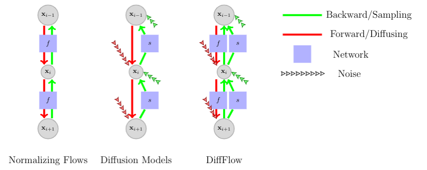
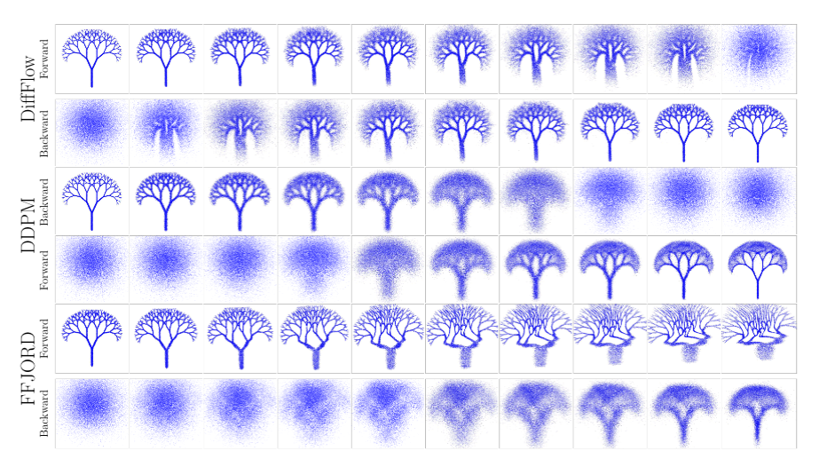

# Diffusion Normalizing Flow (DiffFlow)




## Reproduce

### setup environment

The repo heavily depends on [jam](https://github.com/qsh-zh/jam), a personal toolbox developed by [Qsh.zh](https://github.com/qsh-zh). The API may change and check the [jammy](https://jammy.readthedocs.io/en/stable/index.html) version for running the repo.

*pip*
```shell
pip install .
```

*[poetry](https://python-poetry.org/)*
```shell
curl -fsS -o /tmp/get-poetry.py https://raw.githubusercontent.com/sdispater/poetry/master/get-poetry.py
python3 /tmp/get-poetry.py -y --no-modify-path
export PATH=$HOME/.poetry/bin:$PATH
poetry shell
poetry install
```

### Run

```shell
python main.py trainer.epochs=100 data.dataset=tree
```

The repo supports viz results on [wandb](https://wandb.ai/site)
```shell
python main.py trainer.epochs=100 data.dataset=tree log=true wandb.project=pub_diff wandb.name=tree
```

There are some [results](https://wandb.ai/qinsheng/pub_diff?workspace=user-qinsheng) reproduced by the repo.


## Reference

```tex
@inproceedings{zhang2021diffusion,
  author    = {Qinsheng Zhang and Yongxin Chen},
  title     = {Diffusion Normalizing Flow},
  booktitle = {Advances in Neural Information Processing Systems},
  year      = {2021}
}
```
